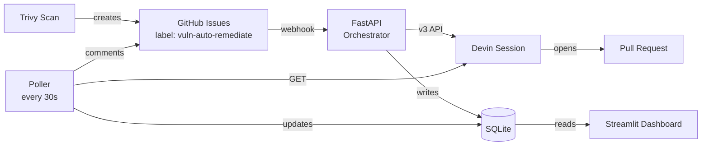

# 🛡️ Devin Vulnerability Remediator

**An event-driven automation that autonomously remediates dependency-level CVEs in Apache Superset, powered by the Devin v3 API.**

---

## The problem

Apache Superset — like any large open-source project — carries dozens of open CVE-related issues at any time. Each fix is small (a version bump, a PR, a review) but collectively they consume hours of senior engineering time per week. Yet unpatched dependencies remain the #1 source of real-world security incidents in web applications.

This is **knowledge work**: read alert → check dep tree → confirm fix → run tests → open PR. The investigate-then-act loop that consumes ~30% of senior engineering time across most orgs.

## The solution

An event-driven pipeline:

1. **Detect** vulnerabilities via Trivy
2. **File** them as structured GitHub issues
3. **React** to `issues.opened` webhooks
4. **Dispatch** each issue to a **Devin v3** session with a precise remediation playbook
5. **Track** every session to completion — PR opened, tests run, issue commented
6. **Surface** the whole flow in a live dashboard (MTTR, success rate, active sessions)

The engineer's role shifts from *doing the work* to *reviewing the PR*. MTTR drops from days to minutes.

---

## Architecture



**Why this shape:**

- **Event-driven, not scheduled** — reacts the moment a CVE is filed
- **Devin is the agent, not the code** — no git/test/PR reimplementation; Devin owns the full multi-step task
- **SQLite as the bus** — zero ops; swap for Postgres in prod with a one-line change
- **Decoupled dashboard** — reads the same DB the orchestrator writes; no HTTP coupling

---

## Why Devin v3 (not v1)

This project was originally built on the Devin v1 API. Migrated to v3 because:

1. **Native `pull_requests` array** on every session response — no regex over message content
2. **`max_acu_limit`** per session — hard cost cap, production-safe
3. **`repos` scoping** — Devin's sandbox can only access whitelisted repos
4. **Cleaner status semantics** — clear enum: `new`/`working`/`blocked`/`finished`/`stopped`/`expired`

The migration story is also visible in the git history.

---

## Quick start

### Prerequisites

- Docker Desktop
- A **Devin service user** with API key (`cog_...`) and the org ID — Devin UI → Settings → Service Users
- A **GitHub Personal Access Token** with `Issues: Read & Write` on your Superset fork
- A **GitHub fork** of `apache/superset` with **Issues enabled** in repo Settings → Features
- (Optional) Trivy: `brew install trivy`

### Configure

```bash
git clone <this repo>
cd devin-vuln-remediator
cp .env.example .env
# Edit .env — fill in DEVIN_API_KEY, DEVIN_ORG_ID, GITHUB_TOKEN, GITHUB_OWNER, GITHUB_REPO
```

### Connect Devin to your GitHub fork

In the Devin web UI → Integrations → GitHub → authorize access to `YOUR_USERNAME/superset`. This lets Devin push branches and open PRs.

### Run

```bash
docker compose up --build
```

- Orchestrator: `http://localhost:8000`
- Dashboard:    `http://localhost:8501`

### Trigger end-to-end (real webhook delivery)

```bash
# 1. Expose the orchestrator
ngrok http 8000

# 2. In your Superset fork: Settings → Webhooks → Add webhook
#      Payload URL:  https://<your-ngrok>.ngrok.app/webhook/github
#      Content type: application/json
#      Secret:       <same value as GITHUB_WEBHOOK_SECRET>
#      Events:       Issues only
```

Now create a GitHub issue in your fork with the `vuln-auto-remediate` label. Watch the dashboard light up.

### Auto-create issues from a Trivy scan

```bash
trivy fs --severity HIGH,CRITICAL --format json -o trivy-report.json /path/to/superset
export $(grep -v '^#' .env | xargs)
python3 scripts/create_issues_from_trivy.py trivy-report.json
```

---

## Repo map

```
.
├── app/                              Orchestrator (FastAPI + Devin v3)
│   ├── main.py                       Webhook endpoint + lifecycle
│   ├── db.py                         SQLite persistence
│   ├── devin_client.py               Devin v3 wrapper
│   ├── github_client.py              GitHub REST (issue comments)
│   ├── parser.py                     Lenient body parser
│   ├── prompt_builder.py             Ecosystem-aware prompt rendering
│   ├── poller.py                     Background session reconciler
│   ├── Dockerfile
│   └── requirements.txt
├── dashboard/                        Streamlit observability
│   ├── app.py
│   ├── Dockerfile
│   └── requirements.txt
├── prompts/
│   └── remediate_cve.txt             THE key artifact — Devin's playbook
├── scripts/
│   └── create_issues_from_trivy.py   Scanner → issues
├── tests/
│   └── sample_payload.json
├── docs/
│   ├── LOOM_SCRIPT.md                5-min recording script
│   ├── SLIDES.md                     Slide content reference
│   └── RUNBOOK.md                    Step-by-step first run
├── data/                             SQLite volume mount
├── deck.pptx                         Presentation deck (4 slides)
├── docker-compose.yml
├── .env.example
└── README.md
```

---

## How it works — end-to-end trace

When a new vulnerability issue is filed:

**1. Issue created** (manually or by `create_issues_from_trivy.py`) with structured body:

```
**CVE ID:** CVE-2024-12345
**Package:** cryptography
**Current Version:** 41.0.1
**Fixed Version:** 42.0.4
**Severity:** HIGH
**File:** requirements/base.txt
```

**2. GitHub fires a webhook** to `POST /webhook/github`.

**3. The orchestrator** (`app/main.py`):
- Verifies HMAC signature
- Confirms `vuln-auto-remediate` label
- Parses the body into structured fields (`app/parser.py` — accepts both bold and plain formats)
- Idempotency check — has this issue+CVE pair already been processed?
- Builds a prompt from `prompts/remediate_cve.txt` — adapts install/test commands based on file type (yarn.lock → yarn, requirements.txt → pip)
- Calls Devin v3 `POST /v3/organizations/{org_id}/sessions` with `max_acu_limit=10` and `repos` scoping
- Persists the session row to SQLite

**4. Devin** spins up a VM, clones the fork, creates `fix/cve-2024-12345`, edits the file, runs the test suite, pushes the branch, opens a PR.

**5. The poller** (`app/poller.py`) — every 30s — calls `GET /v3/organizations/{org_id}/sessions/{id}`. When the session reaches a terminal status and `pull_requests` is populated, marks the row `completed` and comments back on the original issue.

**6. The dashboard** (`dashboard/app.py`) reads the same SQLite file and shows live state.

---

## Prompt engineering — the real IP

Quality of Devin's output scales directly with prompt specificity. The remediation prompt (`prompts/remediate_cve.txt`) is:

- **Context-loaded** — every variable Devin needs, top of prompt
- **Strictly numbered** — eight steps, "do not deviate"
- **Ecosystem-aware** — Python files get `pip install` + `pytest`; JS files get `yarn install` + `yarn test`
- **Guardrailed** — "do NOT modify unrelated files", "do NOT merge the PR", "do NOT fix unrelated test failures"
- **Stop-conditioned** — explicit bail-out criteria
- **Schema-bound** — structured output enforced via JSON schema

This template is versioned independently from orchestration code. Prompt iteration is where most quality improvements come from.

---

## Observability

| Tile | Answers |
|---|---|
| **Active Sessions** | Is the system currently doing work? |
| **Completed PRs** | How much work has it shipped? |
| **Success Rate** | How often does it succeed unattended? |
| **Avg MTTR** | How fast is it compared to humans? |

Each session row links to the Devin session URL and the GitHub PR. The orchestrator also emits structured JSON logs on every state transition — pipe these into Datadog/CloudWatch in production.

---

## Safety & guardrails

- **No auto-merge** — every PR requires human review. Enforced via prompt.
- **Scope limitation** — prompt restricts edits to one file.
- **Test gate** — Devin runs the existing suite before opening the PR.
- **ACU budget cap** — `max_acu_limit=10` per session prevents runaway costs.
- **Repo scoping** — Devin's sandbox is locked to the target repo.
- **Idempotency** — duplicate webhooks don't spawn duplicate sessions.
- **Signature verification** — webhook HMAC verified on every request.
- **Secret isolation** — `.env` gitignored; `.env.example` documents the contract.

---

## Production hardening (with more time)

- Slack / PagerDuty integration for failed sessions
- Daily ACU budget caps (not just per-session)
- SAST integration beyond deps (Semgrep, CodeQL) for logic-level fixes
- Multi-repo fan-out — same pipeline, repo-agnostic
- Severity-based routing — CRITICAL gets fast-tracked; MEDIUM gets batched weekly
- Prometheus / Datadog metric export
- Postgres swap-in for the DB (one-line change in `db.py`)
- Webhook retry queue (Celery / Redis Streams)
- Rate limiting + auth on the orchestrator endpoint

---

## Why Devin for this task

Autocomplete tools help a human write code faster — they don't perform tasks. This is a **task**: clone → branch → edit → install → test → commit → push → open PR. Seven sequential steps, each with failure modes, each requiring real environment access.

Devin owns that loop end-to-end in a sandboxed VM. The orchestrator in this repo is ~400 lines of glue. The actual engineering work happens inside Devin.

> Pick a narrow task. Add hard guardrails. Make outcomes observable. Keep humans on the decision that matters. That's how agents earn production trust.
